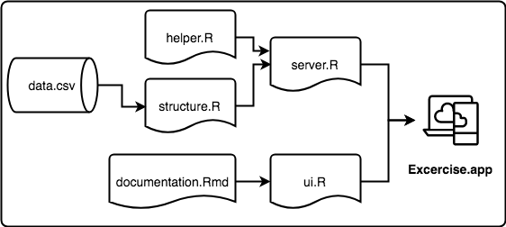

## Recruitment Candidate Exercise App Documentation

----

### Directory

- `ui.R`: user interface object that controls the layout and appearance.
- `server.R`: instructions to build the analysis app. 
- `helper.R`: script with functions that aids the analysis.
- `structure.R`: script that loads libraries requiered for the analysis, data and the functions.
- `documentation.Rmd`: documentation of the app.
- `/data/data.csv`: data file directory.

---

### Structure

---

### Functions

The analysis requires five main functions: 

- `fun_adstock_calc`: adstock function $adstock_{(i)} = investment_{(i)} + [ \alpha \cdot adstock_{(i-1)} ]$
  - **Input**: 
    - spend: vector of media spend
    - rf: retention factor [0, 1]
  - **Output**:
    - adstock: adstock measure
    
    
    
- `fun_model_lm`: model 1 function $Search\;Volume_{t} = \beta_0 + \beta_1 * Adstock_{t} + \sum_{i=1}^3 \beta_{2,i }*campaign_i$
  - **Input**: 
    - tbl_mod: data
  - **Output**:
    - list of elements: 
      - mod: model
      - tab_eff: model coeficients and intervals
      - tab_fit: model fit     

- `fun_model_bayes`: model 2 function $Search\;Volume_{t} = \beta_0 + Search\;Volume_{t-1} + \beta_1 * Adstock_{t} + \sum_{i=1}^3 \beta_{2,i }*campaign_i$
  - **Input**: 
    - tbl_mod: data
  - **Output**:
    - list of elements: 
      - mod: model
      - tab_eff: model coeficients and intervals
      - tab_fit: model fit     
    
- `fun_gg_chart_fit`: gg chart fit
  - **Input**: 
    - mod_list: list of elements
  - **Output**: 
    - gg.1: plot of fitted values vs observed values    
    
    
- `fun_tab_camp_eff`: function table efficiencies
  - **Input**: 
    - mod_list: list of elements
  - **Output**: 
    - tab_td: table of campaign effects to print    
      
---      
      
### Links:

Code [Recruitment candidate exercise](https://github.com/Songeo/recruitmentCandidateExercise)

Author [Songeo](https://github.com/Songeo)

Original [schubertjan](https://github.com/schubertjan/recruitmentCandidateExercise)